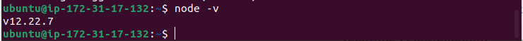
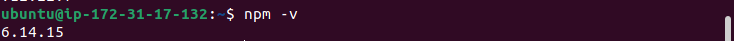
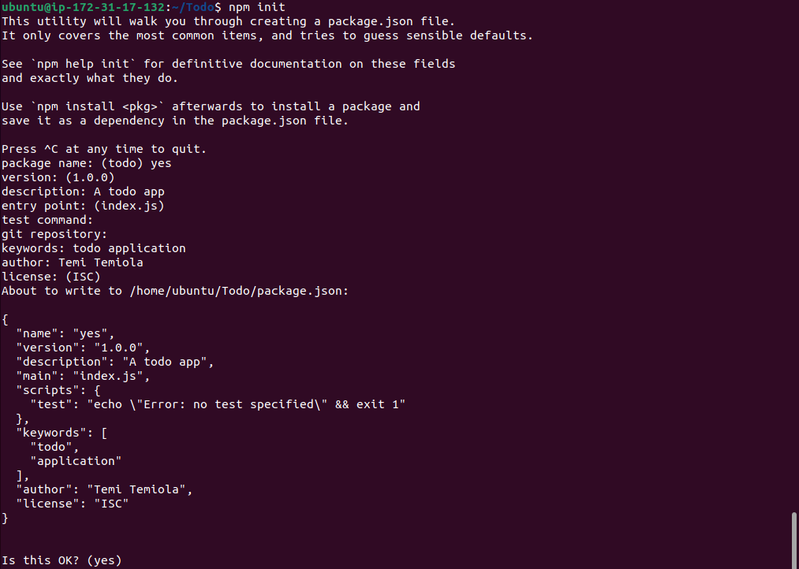
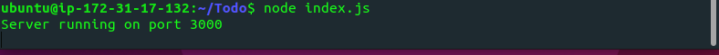
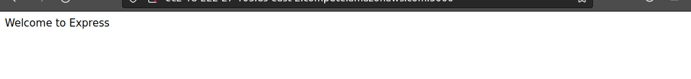
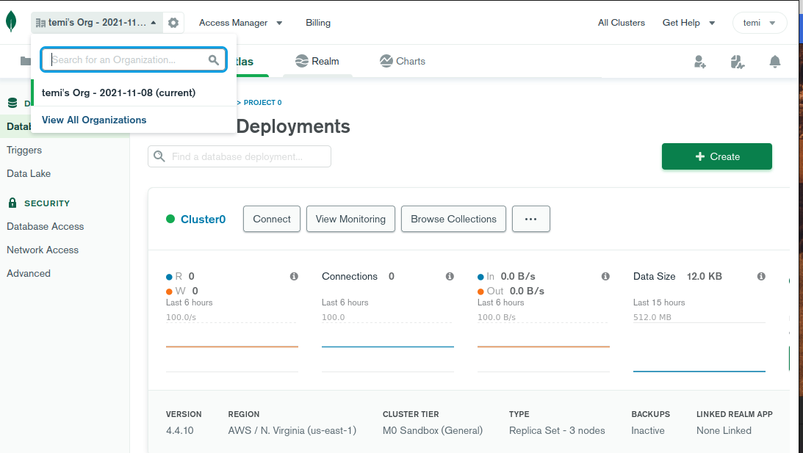

# MERN STACK IMPLEMENTATION
The MERN stack is a web framework which delivers powerful results simply and efficiently especially when the goal is to build sophisticated web applications.

The process of implementing this framework is explained. The first process is connect my local terminal to aws Ubuntu server using the EC2 instance, I will be using the bash terminal for all the configuration and implementation.

The first step is update and upgrade Ubuntu using this line of code

`:~ $ sudo apt update && sudo apt upgrade`

After this step, I went on to get the location of Node.js software from Ubuntu repositories, using this command:

`:~ $ curl -sL https://deb.nodesource.com/setup_12.x | sudo -E bash -`

The next step is to install Node.js after obtaining the key, this was done with this code: 

`:~ $ sudo apt-get install -y nodejs`

I verified that node.js is running, screenshot below.

I also verified that npm was also correctly installed.

Now that I have confirmed that the node.js is installed, I then proceed to initialize my project, using this code:

`:~ $ npm init` 
 
 This will allow a package.json file to be created. The file contains information about the application and dependencies required for applications to run smoothly.

 

 ## Installing Express
 ___
 
The next step is to install express which is a framework used in node.js and create an index file. To do this i used the commands below:

`:~ $ npm install express` 

`:~ $ touch index.js`

After this I went on to install dotenv which is just a dependency file used to store variables in an application environment. I used this command:
 
`:~ $ npm install dotenv`

 When this was done, I went on to edit the index.js file earlier created and wrote code which will be used to configure the Server. I used port 3000 for communication port between app and server.

`:~ $ nano index.js`

 

 After running this , I ran this command to check if the server will be listening on 3000.

`:~ $ node index.js`

The screenshot is below

After making sure that my Todo app has been successfully configured to listen on a port in the server, I went on to create a routes folder; this folder contains what the app will do like get, post and delete. A file called the api.js was created and the code that will be used to execute those functions were placed in the file. 

`:~ $ mkdir routes`

`:~ $ cd routes`

`:~ $ touch api.js`

The next step is to create a model; this is usually considered the heart of JavaScript which is used to make the Todo app more interactive.

 ### Creating a Schema and a model
 ___
After which I install mongoose using the command:

`:~ $ npm install mongoose`

The mongoose makes working with node.js easier. Now the interesting part is to is to create a directory called models, and create a file called todo.js. I used this line of code to execute these aforementioned steps.

`:~ $ mkdir models && cd models && touch todo.js`

After which i did edited the api.js which now contains the router information such as get, delete and post. 

 ## Configuring MongoDB
 ___ 

To store information in the todo app, I need a database: MongoDB. This database is a non-relational database. The next step is to create a MongoDB database and collection inside mLab, usually called Cluster. 

Now that I have a working database, I then proceed to create an .env file: This file contains information about the MongDB credentials.
The next step is to edit to index.js file to reflect the .env file which will be used by node.js to connect to the MongoDB.

The use of environment variables to store information was solely done in other to secure the configuration and secret data for the application, as against writing connection strings directly to the index.js file.

After this configuration, I ran the file to see if the database has been successfuly configured.

